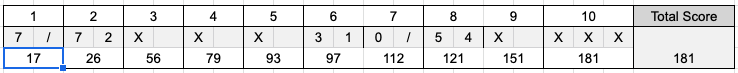

# The Bowling Game Kata (Java) - Uncle Bob Martin

## Objective
Use TDD to create a simple application to score a game of bowling

   
## Scoring Bowling.
The game consists of 10 frames as shown above. In each frame the player has
two opportunities to knock down 10 pins. The score for the frame is the total
number of pins knocked down, plus bonuses for strikes and spares.

A spare is when the player knocks down all 10 pins in two tries. The bonus for
that frame is the number of pins knocked down by the next roll. So in frame 3
above, the score is 10 (the total number knocked down) plus a bonus of 5 (the
number of pins knocked down on the next roll.)

A strike is when the player knocks down all 10 pins on his first try. The bonus
for that frame is the value of the next two balls rolled.

In the tenth frame a player who rolls a spare or strike is allowed to roll the extra
balls to complete the frame. However no more than three balls can be rolled in
tenth frame.

[Video: How to keep score in bowling](https://www.youtube.com/watch?v=aBe71sD8o8c)

[Online Bowling Score Calculator](https://www.bowlinggenius.com/)

[comment]: <> ([Code Dojo - Demonstration Video]&#40;https://www.youtube.com/watch?v=OPGTPQ4kURU&#41; )

## Getting Started
1. Fork and clone this repository
1. Write your tests in src/test/java/com/galvanize/bowling/GameTest.java
1. Implement your tests in src/main/java/com/galvanize/bowling/Game.java

### Acceptance Criteria
1. Can create a new game
    - Score should be zero
1. Can record rolling of ball
1. Can score a game of all (20) gutters
    - Score of zero
1. Can score a game of all (20) ones
    - Score of 20
1. Can score a game with one spare (say two fives), followed by two rolls with three pins down each, and the rest (17) gutters
    - Score of 19
1. Can score a game with one strike, followed by two rolls with three pins down each, and the rest (16) gutters
    - Score of 22
1. Can score a perfect game - ten strikes + two bonus 10s in the tenth frame
    - Score of 300
   
